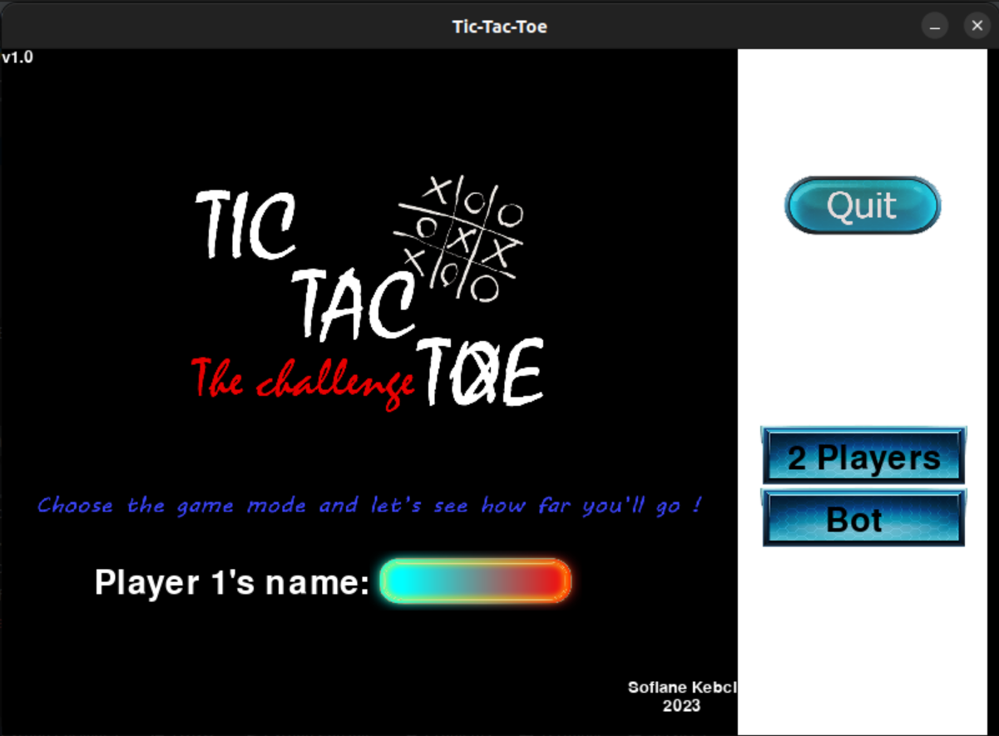

<h1 align="center" > TIC-TAC-TOE </h1>
<h3 align = "center" >Personal Projet 1 </h3> 

  </img>

<h2 align="center">Programming language :</h2>
 

<h2 align="center">Operating system :</h2>

<h2 align="center">Tool :</h2>
 

